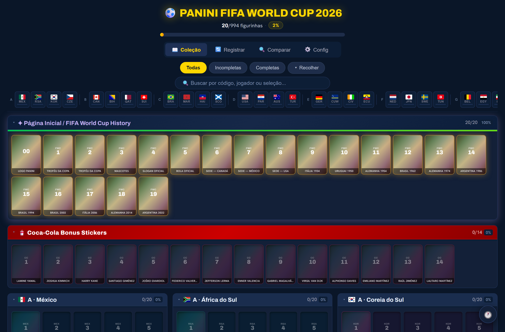

# ⚽ Sticker Tracker — Copa 2026

Acompanhe o preenchimento do seu álbum Panini da Copa do Mundo FIFA 2026 direto do navegador: marque figurinhas, controle repetidas e faltantes, registre envelopes e trocas, e compare sua coleção com a de amigos.



## 🔗 Acesso

**App no ar:** **https://sticker-tracker2026.vercel.app**

Para entrar, você pode:

- **Criar conta com e-mail e senha**, ou
- **Entrar com Google** (1 clique).

Cada pessoa tem a **própria coleção, isolada das demais** (garantido por RLS no banco) — então é seguro compartilhar o link com amigos: ninguém vê nem altera a coleção do outro.

> Os dados ficam salvos na nuvem (Supabase), então sua coleção te acompanha em qualquer dispositivo ao logar com a mesma conta.

## 📋 O que é

Um *tracker* completo do álbum da Copa 2026 — **994 figurinhas** (todas as seleções + as seções especiais **FWC** e **Coca-Cola**), organizado em abas:

- **📖 Coleção** — todas as figurinhas agrupadas por seleção e seções especiais. Marque com um toque, filtre por *todas / incompletas / completas*, busque por código ou seleção e use a barra de bandeiras pra pular rápido. Tem barra de progresso geral e visual próprio pras figurinhas *foil* e especiais.
- **🔄 Registrar** — registre a **abertura de um envelope** (cole os códigos: as novas viram coladas, as que você já tem viram +1 repetida) e registre **trocas** (entreguei / recebi). Mostra também suas **repetidas** e **faltantes**.
- **🔍 Comparar** — cole as **repetidas** (e, opcionalmente, as **faltantes**) de um amigo e calcule o **match**: o que você pode pegar e o que pode oferecer, com uma **mensagem pronta pra copiar** e mandar.
- **⚙️ Config** — **importe em massa** suas figurinhas coladas, repetidas e faltantes por texto; veja sua conta e saia.
- **🕐 Histórico** — painel com **todas as alterações** (marcações, trocas, envelopes, importações) e botão de **desfazer**.

## 🧱 Tecnologias

- **Next.js 14** (App Router) + **React 18**
- **Supabase** — Postgres (progresso e histórico por usuário), Auth (e-mail/senha + Google) e **RLS** (isolamento por usuário)
- **Vercel** — deploy contínuo (push na `main` → build automático)
- Catálogo das 994 figurinhas embutido em `data/stickers.json`
- Tema escuro responsivo (mobile-first, com barra de abas no rodapé; layout em colunas no desktop)

## 📁 Estrutura

```
app/           rotas do App Router (page, login, auth/callback, logout, layout) + globals.css
components/    UI por feature — colecao/ trocas/ comparar/ config/ history/ stickers/ ui/
hooks/         useTrackerState — estado da coleção + integração com o Supabase
utils/         funções puras (parse de códigos colados, agrupamento por seleção, etc.)
lib/           clientes Supabase (browser e server)
data/          catálogo das figurinhas (stickers.json, players.js)
middleware.js  refresh da sessão Supabase
```

## 💻 Rodar localmente

Pré-requisitos: **Node 18+** e um projeto **Supabase** (na nuvem ou local via CLI).

```bash
# 1. dependências
npm install

# 2. variáveis de ambiente
cp .env.local.example .env.local
# preencha com a URL e a anon key do seu projeto (Supabase → Project Settings → API):
#   NEXT_PUBLIC_SUPABASE_URL=...
#   NEXT_PUBLIC_SUPABASE_ANON_KEY=...

# 3. servidor de desenvolvimento
npm run dev        # http://localhost:3000
```

Para o banco, rode o **`supabase/schema.sql`** no **SQL Editor** do Supabase — ele cria as tabelas, ativa **RLS** (cada usuário só acessa as próprias linhas) e popula o catálogo:

- `stickers` — catálogo das 994 figurinhas (referência de integridade do progresso)
- `user_progress` — figurinhas coladas e repetidas por usuário
- `history_events` — log de alterações (alimenta o histórico e o desfazer)

E, em **Authentication → Providers**, habilite **Email** e **Google**. Para o Google, defina em **Authentication → URL Configuration** a *Site URL* e a *Redirect URL* terminando em `/auth/callback` (a de produção e, pra testar, `http://localhost:3000/auth/callback`).

## 🚀 Deploy

Hospedado na **Vercel** com deploy automático: todo push na branch `main` dispara um novo build de produção.

```bash
git push origin main   # → build + deploy automáticos na Vercel
```
